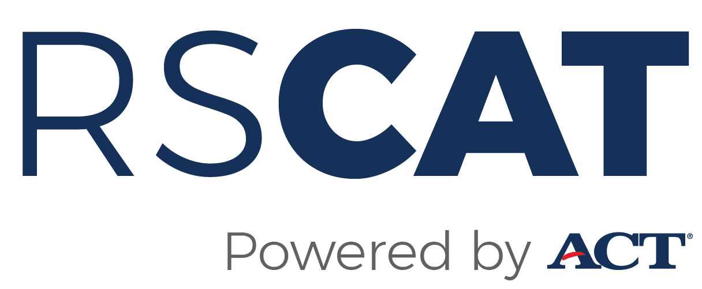

[](https://cran.rstudio.com/web/packages/RSCAT/index.html)

## Overview
As an advanced approach to computerized adaptive testing (CAT), 
shadow testing (van der Linden, 2005, <doi:10.1007/0-387-29054-0>) dynamically assembles entire shadow tests as a part of 
selecting items throughout the testing process. 
Selecting items from shadow tests guarantees the compliance of all content 
constraints defined by the blueprint. RSCAT is an R package for the 
shadow-test approach to CAT. The objective of 
RSCAT is twofold: 1) Enhancing the effectiveness of shadow-test CAT simulation;
2) Contributing to the academic and scientific community for CAT research.
CAT algorithms are implemented in Java. The shadow-test MIP is modeled in FICO Xpress-Mosel.
R functions and classes are provided as API wrappers to configure and run CAT simulations in the R
environment.

## Install & Setup
If RSCAT is installed from the CRAN repository, please refer to the "README.md" file in the RSCAT CRAN package or the branch "CRAN-Publication" for the instructions.  
Please note that the RSCAT package depends on Java and the R library "rJava". The following instructions have been tested on multiple Windows and Mac OS machines. It is not guaranteed that these instructions will work on every machine. You may experience some issues of installing and running Java and rJava, especially on Mac OS. These issues are out of scope of these instructions and the best place to find answers is Dr. Google. Some useful information can be found at (https://zhiyzuo.github.io/installation-rJava/).

### For Windows
1. Install Java SE Runtime Environment 8 64-bit (https://www.oracle.com/technetwork/java/javase/downloads/jre8-downloads-2133155.html).
Make sure Java and R are both of 64bit architecture.
2. Install FICO Xpress with the community license (https://content.fico.com/xpress-optimization-community-license?utm_source=FICO-Community&utm_medium=optimization-homepage) 
3. In the R environment, install the "devtools" R package.
4. Clone or download the RSCAT project from repository. Rename the project folder without special characters, e.g., "RSCAT".
5. In the R environment, set the root directory of RSCAT as the working directory.
6. In the R environment, run `devtools::install()` to install the RSCAT package. If you get errors like
"Error: package or namespace load failed for 'rJava':", try to run `Sys.setenv(JAVA_HOME='')` first. If errors still exist, try one of the followings:
    - Uninstall and reinstall Java and R.
    - In R, set "JAVA_HOME" to the directory containing "jvm.dll", e.g., `Sys.setenv(JAVA_HOME = "C:\\Program Files\\Java\\jre1.8.0_201\\bin\\server")`. And run `options(devtools.install.args = "--no-multiarch")`.
7. In the R environment, load RSCAT using `library(RSCAT)`.
8. In the R environment, run `setupJars()` to download JAR dependencies.   
9. In the R environment, run `setupXprm(path)` to copy xprm.jar to RSCAT, where `path` is the absolute directory of xprm.jar in the Xpress installation folder, e.g., "C:/xpressmp/lib/xprm.jar"
10. Restart the R session (run`.rs.restartR()` if RStudio is used as the IDE).

### For Mac OS
1. Install Java SE Development Kit 8 64-bit (https://www.oracle.com/technetwork/java/javase/downloads/jdk8-downloads-2133151.html)
Make sure Java and R are both of 64bit architecture.
2. In Terminal, run `sudo R CMD javareconf`. Make sure there are no errors or warnings. If there are, address them and run it again.
3. In Terminal, run `sudo ln -sf $(/usr/libexec/java_home)/lib/server/libjvm.dylib /usr/local/lib`
4. Install FICO Xpress with the community license (https://content.fico.com/xpress-optimization-community-license?utm_source=FICO-Community&utm_medium=optimization-homepage) 
4. In the R environment, install the "devtools" R package.
5. Clone or download the RSCAT project from repository. Rename the project folder without special characters, e.g., "RSCAT".
6. In the R environment, set the root directory of RSCAT as the working directory.
7. In the R environment, run `devtools::install()` to install the RSCAT package.
8. In Terminal, run `sudo ln -s /Applications/FICO\ Xpress/xpressmp/lib/*.dylib /usr/local/lib`.
9. In the R environment, load RSCAT using `library(RSCAT)`.
10. In the R environment, run `setupJars()` to download JAR dependencies securely via https.
11. In the R environment, run `setupXprm(path)` to copy xprm.jar to RSCAT, where `path` is the absolute directory of xprm.jar in the Xpress installation folder, e.g., "/Applications/FICO Xpress/xpressmp/lib/xprm.jar"
12. Restart the R session (run`.rs.restartR()` if RStudio is used as the IDE).

## Run Shiny App
### For Windows
In the R environment, run `library(RSCAT)` to load and attach the package.
In the R environment, run `launchApp()` to start the Shiny app for CAT configuration and simulation.

### For Mac OS
Additional settings for environment variables are required for R. Suppose FICO Xpress is installed at /Applications/FICO Xpress/xpressmp.
In the R environment, run the following code in R **every time** before loading/attaching RSCAT:
```
Sys.setenv(JAVA_LIBRARY_PATH = '/Applications/FICO Xpress/xpressmp/lib')
Sys.setenv(XPRESS='/Applications/FICO Xpress/xpressmp/bin')
Sys.setenv(MOSEL_DSO='/Applications/FICO Xpress/xpressmp/dso')
```
If RSCAT was loaded previously, run `.rs.restartR()`. If not,
run `library(RSCAT)` to load and attach the package.
In the R environment, run `launchApp()` to start the Shiny app for CAT configuration and simulation.

## Item & Passage Pool Definition
The item and passage identifiers should be specified in the column "Item ID" and "Passage ID", respectively.
The item IRT parameters should be specified in the columns "A-Param", "B-Param", and "C-Param" in the item pool.

## Content Specification Constraint Definition
The syntax to define constraints is provided in "/extdata/constraint_syntax.xlsx".

## Example Data
Example item pools, passage pools, and constraint sets CSV files are in "/extdata".Two test blueprints can be used
as follows:<p>
1. Blueprint #1
  - Test length: 10
  - Item pool: itempool10Items.csv
      - Numeric columns: Maximum Score,A-Param,B-Param,C-Param,A-Param-SE,B-Param-SE,C-Param-SE,D-Constant,P-value,Ptbis,Word Count,Depth of Knowledge
  - Constraint set: constraintSet1.csv
2. Blueprint #2
  - Test length: 20
  - Item pool: itemPool720Items.csv
      - Numeric columns: Maximum Score,A-Param,B-Param,C-Param,A-Param-SE,B-Param-SE,C-Param-SE,D-Constant,P-value,Ptbis,Word Count,Depth of Knowledge
  - Passage pool: passagePool30Passages.csv
      - Numeric columns: Word Count,Difficulty Level
  - Constraint set: constraintSet2.csv

## Choose MIP Solvers
RSCAT works with MIP solvers that support the nl format, e.g., FICO Xpress, CPLEX,
lpsolve, and CBC. The Mosel MIP model uses the "nlsolv" module to support external 
solvers. RSCAT uses Xpress as the default solver. To switch to another solver, first detach the RSCAT package and restart the R session. Then open the "RSCAT" archive 
jar file installed under "/java" and edit the Mosel script "/org/act/mosel/shadow_test.mos". In the Mosel script, the module "mmxprs" is used for Xpress while "nlsolv" is used for other solvers. When "nlsolv" is used, the user needs to set the parameter "nl_solverpath" with the solver installation directory. Additional information for configuring a solver can be obtained from https://www.fico.com/fico-xpress-optimization/docs/dms2018-02/mosel/mosel_solvers/dhtml/nlsolv.html. After editing, save the Mosel file in the JAR archive and reload the package.

## Contact
For technical issues and questions related to RSCAT, please send emails to rscat@act.org
